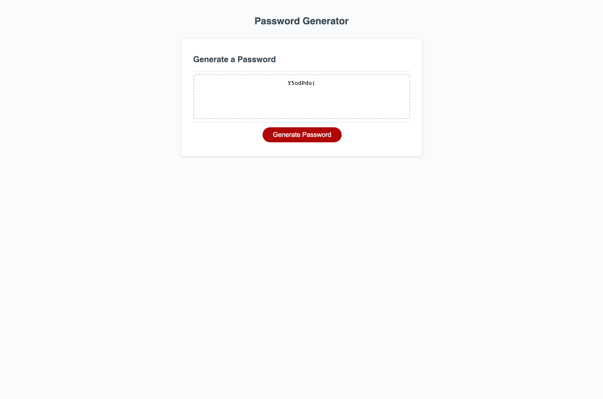

# Password Generator Starter Code
#Arnasia Porfolio Website

##Description of Project
In this project we was challenged to utilize JavaScript to create a password generator. The project prompts the user with numerous of preference questions that will show as pop-ups before the password is generated into the box. The user have the option to choose between how many characters they want their password to be as well as what they would like their password to contain.

##App Mock-Up

##Live App Link
* Click this [link](https://arnasia.github.io/JavaScript-Challenge3/) to access the Password Generator website live.

##Contact Info
If you would like to contact me you can reach me at[arnasial.jackson@gmail.com](arnasial.jackson@gmail.com).